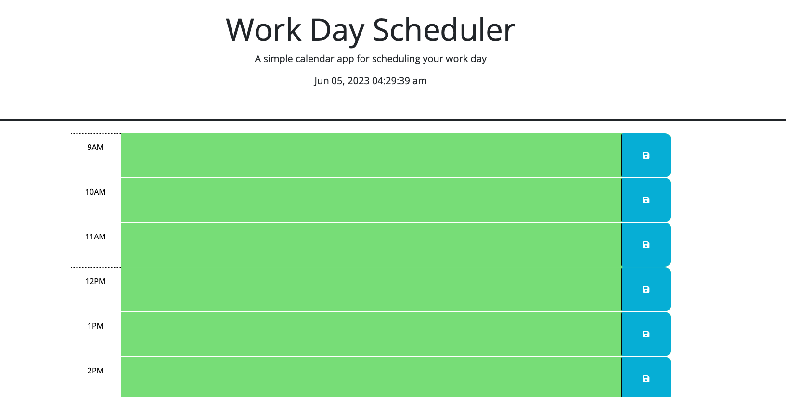
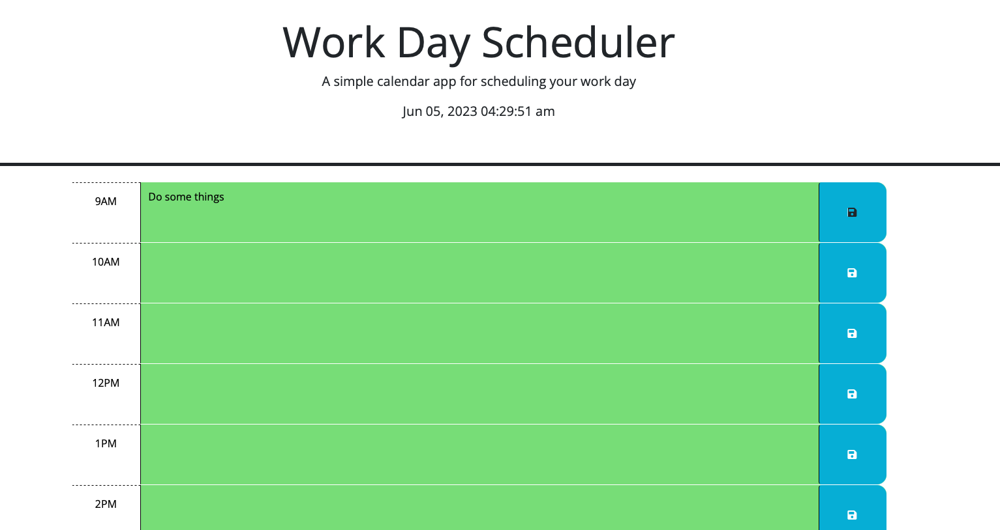
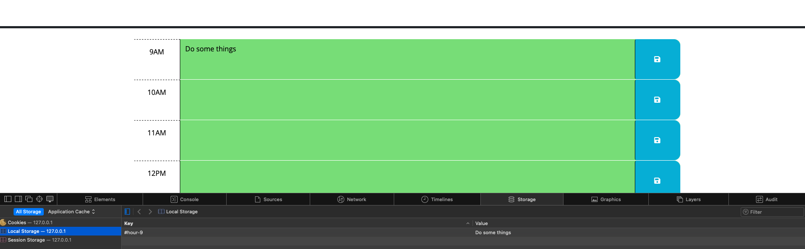

# Daily-Planner

## Description

- This project was built to further my understanding and apply what I learned about third party APIs. In an effort to apply the concepts I learned in our course using Jquery, bootstrap, and Dayjs. When writing out the code for this project I challenged myself to make a better effort to stick to the concept of DRY and not repeat myself and make it more of a challenge overall. I found myself learning more about how to properly used the Jquery selectors and how to better use and access the local storage on the browser.

## Table of Contents

- [Installation](#installation)
- [Usage](#usage)
- [Credits](#credits)
- [License](#license)

## Installation

N/A

## Usage

- Navigate to: [https://alexanderolivares13.github.io/Daily-Planner]

- You will be presented with the Daily Planner, you will be able to click the (currently green) text box and add text to each hour block section to plan out your day.

- As shown below you can add plans and hit the save button to the right of each respective box.

- Clicking the save button will save the text in the boxes to your local storage and your will be able to go back and view your plans throughout the day even if you refresh the page. The boxes will change color based on the time of day and will be gray if the time on the left is in the past, red for the current hour, and green for any future events.

## Credits

- Starter code obtained from the course: [https://git.bootcampcontent.com/University-of-Minnesota/UofM-VIRT-FSF-PT-04-2023-U-LOLC-ENTG/-/tree/main/05-Third-Party-APIs/02-Challenge]

## License

- Please refer to the LICENSE in the repo.